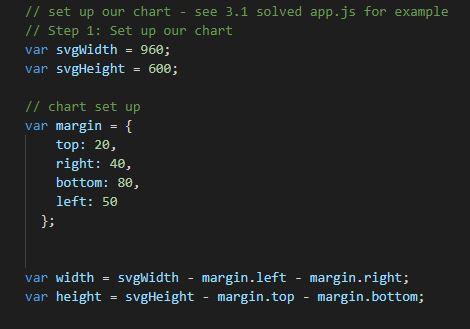
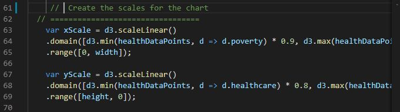
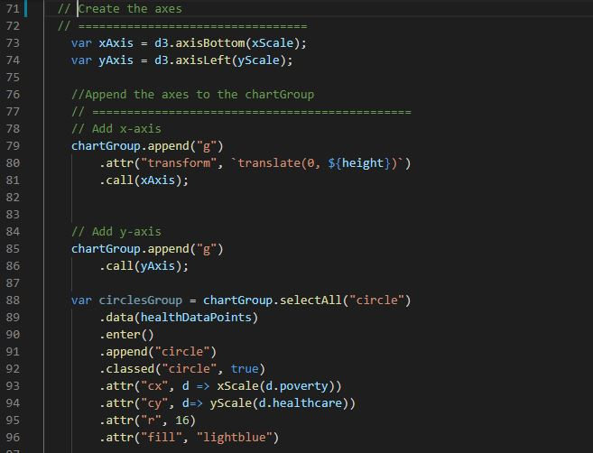
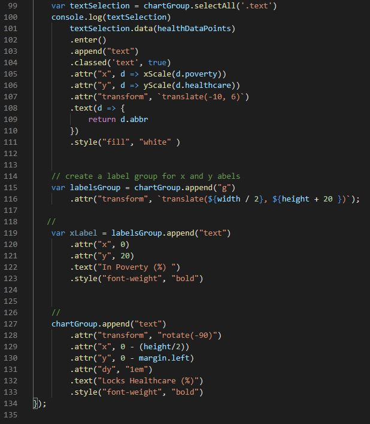
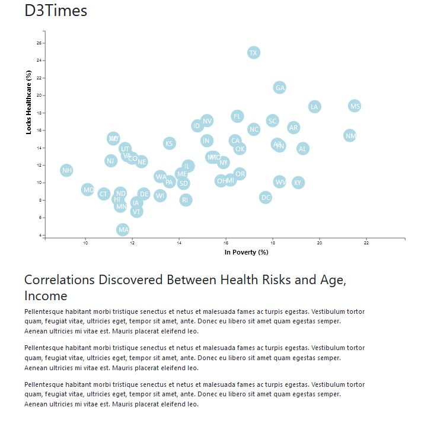

# Data Journalism and D3

## Project Purpose
Analyze datasets from the US Census Bereau and the Behavioral Risk Factor Surveillance System.  The data set includes data on rates of income, obesity, poverty etc, by state (MOE stands for margin of error).  Create a scatter plot between two of the data variables such as Healthcare vs Poverty or Smokers vs Age.  Using D3 techniques to make the scatter plot represent each state within a circle element.

## Process
### Step 1 
Set up our chart

### Step 2 and 3
Import and parse data

### Step 4 
Create scales for the chart

### Step 5 and 6
Create the axes and append them to the chart 

## Results

